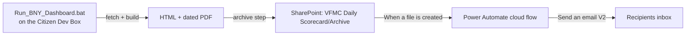

# BNY Dashboard — Automated Email (Power Automate Cloud Flow)

**Purpose:** Automatically email the latest BNY Executive Dashboard PDF after each run,
using a Power Automate **cloud flow**. No admin rights, no local Outlook, no stored
credentials, and no Windows Task Scheduler required — the flow runs in Microsoft 365
under your account.

**Status:** Phase 1 (email distribution). Phases 2–3 (automating the run itself on the
Citizen Dev Box) are parked pending specialist sign-off on unattended portal login.

---

## Background & design principle

The solution splits cleanly into two parts:

- **Local machine generates** — `Run_BNY_Dashboard.bat` does `fetch → HTML → PDF → archive`.
  The archive step drops the dated PDF into the SharePoint-synced `Archive` folder.
- **The cloud distributes** — a Power Automate cloud flow watches that `Archive` folder
  and emails the PDF.

This split was chosen because:

- Power Automate **cloud** flows cannot run local Python or drive the Eagle portal browser
  login — they only use connectors (SharePoint, Outlook, etc.).
- The target machines run **"new Outlook"**, which does **not** support COM automation, so a
  local Python → Outlook email step is not possible.
- Task Scheduler access is not available.

Emailing from the cloud sidesteps all three constraints.



---

## Reference details

| Item | Value |
| --- | --- |
| **Site Address** | `https://vfmcorp.sharepoint.com/sites/External-VFMCBNYMellon` |
| **Library Name** | `Documents` (the "Shared Documents" library) |
| **Folder to watch** | `General/Operations/VFMC Daily Scorecard/Archive` |
| **PDF name pattern** | starts with `BNY_Executive_Dashboard_Services_`, ends with `.pdf` |

---

## Build steps

### Step 1 — Create the flow

1. Go to **make.powerautomate.com** and sign in with your VFMC account.
2. Left menu → **Create** → **Automated cloud flow**.
3. **Flow name:** `BNY Dashboard – email latest PDF`.
4. In "Choose your flow's trigger," search **when a file is created** →
   select **SharePoint → When a file is created (properties only)**.
5. Click **Create**.

### Step 2 — Configure the trigger

On the trigger card:

- **Site Address:** select *External-VFMCBNYMellon* from the dropdown.
- **Library Name:** `Documents`.
- **Folder:** click the folder icon and browse to
  `General → Operations → VFMC Daily Scorecard → Archive`.

### Step 3 — Filter to just the dashboard PDF

1. **+ New step** → search **Condition** → select **Control → Condition**.
2. Left box: **Add dynamic content** → **File name with extension** (from the trigger).
3. Operator: **contains**.
4. Right box: `BNY_Executive_Dashboard_Services_`

   *Optional stricter check:* inside the condition click **+ Add**, set the group to **And**,
   and add a second row — `File name with extension` **ends with** `.pdf`.

### Step 4 — Get the file's content (inside "If yes")

1. In the **If yes** branch → **Add an action** → **SharePoint → Get file content**.
2. **Site Address:** same site.
3. **File Identifier:** **Add dynamic content** → **Identifier** (from the trigger).

### Step 5 — Send the email (inside "If yes")

1. **Add an action** → **Office 365 Outlook → Send an email (V2)**.
2. **To:** your own address for the trial (e.g. `tsmith@vfmc.vic.gov.au`).
3. **Subject:** `BNY Services Daily Scorecard` (optionally append the date).
4. **Body:** for example —
   > Good morning,
   >
   > Attached is the latest BNY Managed Data Services Executive Service Health dashboard,
   > generated automatically from the Eagle client portal export.
5. Click **Show advanced options** → **Attachments**:
   - **Attachments Name – 1:** dynamic content → **File name with extension** (trigger).
   - **Attachments Content – 1:** dynamic content → **File content** (from *Get file content*).

### Step 6 — Save & test

1. Click **Save**.
2. Click **Test** → **Manually** → **Test**, then run `Run_BNY_Dashboard.bat` once. When the
   archive step drops the PDF into `Archive`, the flow fires and the email arrives.
3. Alternatively, upload a copy of an existing PDF into the `Archive` folder to force a dry run.

---

## After it works

- Widen the **To** field to the real distribution list, for example:
  `DA@vfmc.vic.gov.au`, `cli@vfmc.vic.gov.au`, `anorton@vfmc.vic.gov.au`, `nanuwar@vfmc.vic.gov.au`.
- Optionally switch the body to HTML for nicer formatting, or add a **cc**.

---

## Gotchas

- **Double-firing from sync churn:** OneDrive re-syncing can occasionally trigger the flow
  twice. If you see duplicate emails, open the trigger → **Settings → Trigger Conditions**
  and add:

  ```
  @endswith(triggerOutputs()?['body/{FilenameWithExtension}'], '.pdf')
  ```

- **Connector sign-in:** the first time you add the SharePoint and Outlook steps, Power
  Automate prompts you to create a connection — approve with your VFMC account. The email
  sends **as you**, so no separate credentials are stored.

---

## Roadmap (parked)

- **Phase 2 — automate the run:** use **Power Automate Desktop (PAD)** on the Citizen Dev
  Box to run `Run_BNY_Dashboard.bat` on a schedule (no Task Scheduler needed). *Blocker to
  resolve first:* unattended Eagle portal login — the Playwright `.auth` session must stay
  valid, or a stored service credential is needed. This is an **SSO/MFA + governance
  decision** for the specialists.
- **Phase 3 — fully hands-off:** PAD runs the `.bat` on schedule → PDF lands in SharePoint →
  the Phase 1 flow emails it. End-to-end automation with no manual step.
